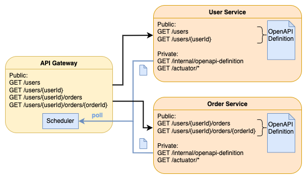

# OpenAPI Route Definition Locator for Spring Cloud Gateway

[](https://search.maven.org/search?q=g:net.bretti.openapi-route-definition-locator)
[](https://github.com/jbretsch/openapi-route-definition-locator/blob/master/LICENSE)

The OpenAPI Route Definition Locator is a
[RouteDefinitionLocator](https://docs.spring.io/spring-cloud-gateway/docs/3.1.2/reference/html/#configuration)
for [Spring Cloud Gateway](https://spring.io/projects/spring-cloud-gateway) which creates route definitions
dynamically based on OpenAPI (aka Swagger) definitions served by backend (micro)services.

## Why use it?

Let's say you run a number of microservices in a Kubernetes cluster. The microservices provide REST APIs.
Some of those REST API resources should be publicly available via a Spring Cloud Gateway service, some
should only be accessible internally by your microservices. What do you do?

You could manually create a route definition for each public API resource in a static configuration file for
your Spring Cloud Gateway service. But maintaining these route definition gets tedious if you have many
microservices. Even more so if those microservices are maintained by many teams. For instance, API Gateway
releases (or at least configuration changes) must be synchronized with releases of other microservices.
That's no pleasure in a large organization.

Or you can use the OpenAPI Route Definition Locator in your API Gateway to have all routes for your public
API resources automatically configured during runtime. This works roughly as follows:

1. Have your microservices provide an OpenAPI definition for all their public API resources via a
   (non-public) HTTP endpoint.
2. Add the OpenAPI Route Definition Locator Spring Boot starter module to your API Gateway.
3. Configure in the Spring properties of your API Gateway a list of microservice which the
   OpenAPI Route Definition Locator should monitor.
4. The OpenAPI Route Definition Locator regularly retrieves the OpenAPI definitions of your microservices
   and configures a route for each of the operations in those OpenAPI definitions.



## Usage

### Quickstart

Add the Spring Boot Starter module of the OpenAPI Route Definition Locator to your API Gateway service.

Maven
```xml
<dependencyManagement>
   <dependencies>
      <dependency>
         <groupId>net.bretti.openapi-route-definition-locator</groupId>
         <artifactId>openapi-route-definition-locator-bom</artifactId>
         <version>0.3.0</version>
         <type>pom</type>
         <scope>import</scope>
      </dependency>
   </dependencies>
</dependencyManagement>
<dependency>
  <groupId>net.bretti.openapi-route-definition-locator</groupId>
  <artifactId>openapi-route-definition-locator-spring-cloud-starter</artifactId>
</dependency>
```

Gradle Kotlin DSL
```kotlin
implementation(platform("net.bretti.openapi-route-definition-locator:openapi-route-definition-locator-bom:0.3.0"))
implementation("net.bretti.openapi-route-definition-locator:openapi-route-definition-locator-spring-cloud-starter")
```

Add the list of services which the OpenAPI Route Definition Locator should monitor to the `application.yml` of
your Spring Cloud API Gateway.
```yaml
openapi-route-definition-locator:
  services:
    - id: service-users
      uri: http://service-users:8080
    - id: service-orders
      uri: http://service-orders:8080
```

Have the services (configured above) return an OpenAPI (Version 3) definition under the HTTP URL path
`/internal/openapi-definition`.

Say, the `service-users` returns the following OpenAPI definition.
```yaml
openapi: 3.0.3
info:
  title: Users API
  version: 0.1.0
paths:
  /users:
    get:
      responses:
        200:
          description: ''
          content:
            text/plain:
              schema:
                type: string
```

Then the OpenAPI Route Definition Locator creates a route definition that would look like this if you
configured it manually in the `application.yml`.
```yaml
spring:
  cloud:
    gateway:
      routes:
         - id: 36e0f904-0b89-446e-9aee-5cd0285cb54f
           uri: http://service-users:8080
           predicates:
             - Method=GET 
             - Path=/users

         # More routes for http://service-orders:8080. 
```

You can find a fully working example at [sample-apps](sample-apps). See the
[sample-apps/README.md](sample-apps/README.md).

### Advanced Configuration

#### URI to OpenAPI definition

Per default the OpenAPI definition of a service is retrieved via the URL path
`/internal/openapi-definition` relative to the base URL of the respective service. If your
service serves its OpenAPI definition from a different path, you can configure the OpenAPI Route
Definition Locator accordingly (since version 0.3.0). In fact, the OpenAPI definition can be
retrieved from any HTTP(S) URL. The OpenAPI definition URL can be set globally or per service. Of
course, you can set it also globally _and_ per service. The latter overrides the former.

Setting the OpenAPI definition URL globally:
```yaml
openapi-route-definition-locator:
  # Default: /internal/openapi-definition
  openapi-definition-uri: /global-custom-path-to/openapi-definition
```

Setting the OpenAPI definition URL per service:
```yaml
openapi-route-definition-locator:
  services:
    - id: service1
      uri: http://service1:8080
      # OpenAPI definition is retrieved from http://service1:8080/internal/openapi-definition

    - id: service2
      uri: http://service2:8080
      openapi-definition-uri: /custom-path-to/openapi-definition
      # OpenAPI definition is retrieved from http://service2:8080/custom-path-to/openapi-definition

    - id: service3
      uri: http://service3:8080
      openapi-definition-uri: http://openapi-repository/service3/openapi-definition
      # OpenAPI definition is retrieved from http://openapi-repository/service3/openapi-definition
```

#### Default Filters

As the OpenAPI Route Definition Locator is just another `RouteDefinitionLocator`, all
[Default Filters](https://docs.spring.io/spring-cloud-gateway/docs/3.1.2/reference/html/#default-filters)
you have defined in your `application.yml` also apply to the `RouteDefinitions` created by the
OpenAPI Route Definition Locator.

For example:
```yaml
spring:
  cloud:
    gateway:
      default-filters:
        - AddResponseHeader=X-Response-FromGlobalConfig, global-sample-value
```

#### Additional RouteDefinition attributes in OpenAPI definitions

Spring Cloud Gateway route definitions can have more attributes. You may want to use
- additional [predicates](https://docs.spring.io/spring-cloud-gateway/docs/3.1.2/reference/html/#gateway-request-predicates-factories),
- additional [filters](https://docs.spring.io/spring-cloud-gateway/docs/3.1.2/reference/html/#gatewayfilter-factories),
- explicit [ordering](https://docs.spring.io/spring-cloud-gateway/docs/3.1.2/reference/html/#retrieving-the-routes-defined-in-the-gateway), or
- [metadata](https://docs.spring.io/spring-cloud-gateway/docs/3.1.2/reference/html/#route-metadata-configuration)

with the routes created from your OpenAPI definitions.

You can define those attributes within your OpenAPI definitions:
- globally for all operations within one OpenAPI definition and
- for each operation in an OpenAPI definition.

You do this by adding the configuration properties you would have otherwise added to the `application.yml`
to your OpenAPI definition within the object `x-gateway-route-settings` at the top level (for global settings)
or at the operation level (for operation specific settings).

Let's say, the `service-users` provides two HTTP endpoints
- `GET /api/users` and
- `GET /api/users/{userId}`

which should be publicly available as
- `GET /users` and
- `GET /users/{userId}`.

And you want the `GET /users/{userId}` endpoint to be available only after
`2022-01-20T17:42:47.789+01:00[Europe/Berlin]`.

Spring Cloud Gateway offers the `PrefixPath` filter and the `After` predicate for those tasks.

You can use them in your OpenAPI definition as follows.
```yaml
openapi: 3.0.3
info:
  title: Users API
  version: 0.1.
x-gateway-route-settings:
  filters:
    - PrefixPath=/api
paths:
  /users:
    get:
      responses:
        200:
          description: ''
          content:
            text/plain:
              schema:
                type: string
  /users/{userId}:
    get:
      parameters:
        - name: userId
          in: path
          schema:
            type: string
          required: true
      responses:
        200:
          description: ''
          content:
            text/plain:
              schema:
                type: string
      x-gateway-route-settings:
        predicates:
          - After=2022-01-20T17:42:47.789+01:00[Europe/Berlin]
```

Then the OpenAPI Route Definition Locator creates route definitions that would look like this if you
configured them manually in the `application.yml`.
```yaml
spring:
  cloud:
    gateway:
      routes:
         - id: 36e0f904-0b89-446e-9aee-5cd0285cb54f
           uri: http://service-users:8080
           predicates:
             - Method=GET 
             - Path=/users
           filters:
              - PrefixPath=/api
         - id: 4340cb37-882a-4b8f-bc48-d035060d9ac2
           uri: http://service-users:8080
           predicates:
             - Method=GET 
             - Path=/users/{userId}
             - After=2022-01-20T17:42:47.789+01:00[Europe/Berlin]
           filters:
              - PrefixPath=/api
```

The global `x-gateway-route-settings` object and the operation specific `x-gateway-route-settings` objects
are merged according to [JSON Merge Patch (RFC7386)](https://datatracker.ietf.org/doc/html/rfc7386)
with one exception: Merging two lists is done by concatenating them.


So merging
```yaml
x-gateway-route-settings:
  filters:
    - PrefixPath=/api
    - name: SetStatus
      args:
        status: 418
  order: 1
  metadata:
    optionName: "OptionValue"
    compositeObject:
      name: "value"
    aList:
      - foo
      - bar
    iAmNumber: 1
```
and
```yaml
x-gateway-route-settings:
   filters:
      - AddResponseHeader=X-Response-FromOpenApiDefinition, sample-value
  metadata:
    compositeObject:
      otherName: 2
    aList:
      - quuz
```
yields
```yaml
x-gateway-route-settings:
  filters:
    - PrefixPath=/api
    - name: SetStatus
      args:
        status: 418
    - AddResponseHeader=X-Response-FromOpenApiDefinition, sample-value
  order: 1
  metadata:
    optionName: "OptionValue"
    compositeObject:
      name: "value"
      otherName: 2
    aList:
      - foo
      - bar
      - quuz
    iAmNumber: 1
```

#### Configure OpenAPI retrieval properties

##### Retrieval interval

The OpenAPI Route Definition Locator regularly retrieves the OpenAPI definitions from the configured services.
By default, each retrieval run starts 5 minutes after the last run completed. You can configure a different
delay with the following Spring property.

```yaml
openapi-route-definition-locator:
  update-scheduler:
    fixed-delay: 30s
```

See [Converting Durations](https://docs.spring.io/spring-boot/docs/2.7.4/reference/html/features.html#features.external-config.typesafe-configuration-properties.conversion.durations)
for possible duration values.

##### Grace period for removal of route definitions

When the OpenAPI Route Definition Locator encounters a problem while retrieving the OpenAPI definition
from a service, it does _not_ immediately remove its routes definitions. The rationale is: Your service
may still be able to serve normal API requests although there was a problem with retrieving its OpenAPI
definition.

However, after some grace period, the route definitions _are_ removed. The default is 15 minutes.
You can configure a different grace period with the following Spring property. 

```yaml
openapi-route-definition-locator:
  update-scheduler:
    remove-routes-on-update-failures-after: 120s
```

See [Converting Durations](https://docs.spring.io/spring-boot/docs/2.7.4/reference/html/features.html#features.external-config.typesafe-configuration-properties.conversion.durations)
for possible duration values.

#### Disabling the OpenAPI Route Definition Locator

You can disable the OpenAPI Route Definition Locator by setting the Spring property
```yaml
openapi-route-definition-locator:
  enabled: false
```

If this property is not set or set to `true`, the OpenAPI Route Definition Locator is enabled.

## Metrics

The OpenAPI Route Definition Locator provides metrics via [Micrometer](https://micrometer.io/).

If you have
[enabled the Prometheus endpoint](https://docs.spring.io/spring-boot/docs/2.7.4/reference/html/actuator.html#actuator.metrics.export.prometheus)
you can expect output like this:

```
# HELP openapi_route_definition_locator_routes_count Number of routes managed by the OpenAPI Route Definition Locator
# TYPE openapi_route_definition_locator_routes_count gauge
openapi_route_definition_locator_routes_count{upstream_service="service-users",} 2.0
openapi_route_definition_locator_routes_count{upstream_service="service-orders",} 1.0

# HELP openapi_route_definition_locator_openapi_definition_retrievals_seconds Time and count of attempts to retrieve the OpenAPI definition of registered services.
# TYPE openapi_route_definition_locator_openapi_definition_retrievals_seconds summary
openapi_route_definition_locator_openapi_definition_retrievals_seconds{retrieval_result="success",upstream_service="service-orders",quantile="0.5",} 0.0
openapi_route_definition_locator_openapi_definition_retrievals_seconds{retrieval_result="success",upstream_service="service-orders",quantile="0.8",} 0.0
openapi_route_definition_locator_openapi_definition_retrievals_seconds{retrieval_result="success",upstream_service="service-orders",quantile="0.95",} 0.0
openapi_route_definition_locator_openapi_definition_retrievals_seconds{retrieval_result="success",upstream_service="service-orders",quantile="0.98",} 0.0
openapi_route_definition_locator_openapi_definition_retrievals_seconds_count{retrieval_result="success",upstream_service="service-orders",} 14.0
openapi_route_definition_locator_openapi_definition_retrievals_seconds_sum{retrieval_result="success",upstream_service="service-orders",} 0.265787763

openapi_route_definition_locator_openapi_definition_retrievals_seconds{retrieval_result="success",upstream_service="service-users",quantile="0.5",} 0.01048576
openapi_route_definition_locator_openapi_definition_retrievals_seconds{retrieval_result="success",upstream_service="service-users",quantile="0.8",} 0.013631488
openapi_route_definition_locator_openapi_definition_retrievals_seconds{retrieval_result="success",upstream_service="service-users",quantile="0.95",} 0.013631488
openapi_route_definition_locator_openapi_definition_retrievals_seconds{retrieval_result="success",upstream_service="service-users",quantile="0.98",} 0.013631488
openapi_route_definition_locator_openapi_definition_retrievals_seconds_count{retrieval_result="success",upstream_service="service-users",} 16.0
openapi_route_definition_locator_openapi_definition_retrievals_seconds_sum{retrieval_result="success",upstream_service="service-users",} 0.742483821

openapi_route_definition_locator_openapi_definition_retrievals_seconds{retrieval_result="failure",upstream_service="service-orders",quantile="0.5",} 0.018874368
openapi_route_definition_locator_openapi_definition_retrievals_seconds{retrieval_result="failure",upstream_service="service-orders",quantile="0.8",} 0.108003328
openapi_route_definition_locator_openapi_definition_retrievals_seconds{retrieval_result="failure",upstream_service="service-orders",quantile="0.95",} 0.108003328
openapi_route_definition_locator_openapi_definition_retrievals_seconds{retrieval_result="failure",upstream_service="service-orders",quantile="0.98",} 0.108003328
openapi_route_definition_locator_openapi_definition_retrievals_seconds_count{retrieval_result="failure",upstream_service="service-orders",} 2.0
openapi_route_definition_locator_openapi_definition_retrievals_seconds_sum{retrieval_result="failure",upstream_service="service-orders",} 0.127437274

openapi_route_definition_locator_openapi_definition_retrievals_seconds{retrieval_result="failure",upstream_service="service-users",quantile="0.5",} 0.0
openapi_route_definition_locator_openapi_definition_retrievals_seconds{retrieval_result="failure",upstream_service="service-users",quantile="0.8",} 0.0
openapi_route_definition_locator_openapi_definition_retrievals_seconds{retrieval_result="failure",upstream_service="service-users",quantile="0.95",} 0.0
openapi_route_definition_locator_openapi_definition_retrievals_seconds{retrieval_result="failure",upstream_service="service-users",quantile="0.98",} 0.0
openapi_route_definition_locator_openapi_definition_retrievals_seconds_count{retrieval_result="failure",upstream_service="service-users",} 0.0
openapi_route_definition_locator_openapi_definition_retrievals_seconds_sum{retrieval_result="failure",upstream_service="service-users",} 0.0

# HELP openapi_route_definition_locator_openapi_definition_retrievals_seconds_max Time and count of attempts to retrieve the OpenAPI definition of registered services.
# TYPE openapi_route_definition_locator_openapi_definition_retrievals_seconds_max gauge
openapi_route_definition_locator_openapi_definition_retrievals_seconds_max{retrieval_result="success",upstream_service="service-orders",} 0.034150183
openapi_route_definition_locator_openapi_definition_retrievals_seconds_max{retrieval_result="success",upstream_service="service-users",} 0.017678204
openapi_route_definition_locator_openapi_definition_retrievals_seconds_max{retrieval_result="failure",upstream_service="service-orders",} 0.108324783
openapi_route_definition_locator_openapi_definition_retrievals_seconds_max{retrieval_result="failure",upstream_service="service-users",} 0.0
```

