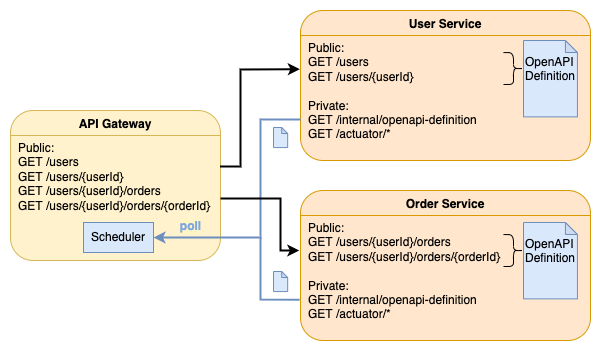

# OpenAPI Route Definition Locator for Spring Cloud Gateway

[](https://search.maven.org/search?q=g:net.bretti.openapi-route-definition-locator)
[](https://github.com/jbretsch/openapi-route-definition-locator/blob/master/LICENSE)

The OpenAPI Route Definition Locator is a
[RouteDefinitionLocator](https://docs.spring.io/spring-cloud-gateway/docs/4.0.9/reference/html/#configuration)
for [Spring Cloud Gateway](https://spring.io/projects/spring-cloud-gateway). It dynamically creates route definitions
based on OpenAPI (aka Swagger) definitions served by backend (micro)services.

## Key Benefits

Let's assume you have a Kubernetes environment, where multiple microservices expose REST APIs, and some API endpoints
need to be publicly accessible through a Spring Cloud Gateway, while others should remain internal. Managing these
routes can be challenging, but the OpenAPI Route Definition Locator simplifies this process.

### Common Challenges

Traditionally, you might resort to:
- manually creating route definitions for each public API endpoint in a static configuration file for Spring Cloud
  Gateway or
- using the [DiscoveryClient](https://docs.spring.io/spring-cloud-gateway/docs/4.0.9/reference/html/#the-discoveryclient-route-definition-locator)
  Route Definition Locator to automatically generate a catch-all route for each microservice.

However, both approaches have significant drawbacks:
- Static route management becomes increasingly cumbersome as the number of microservices grows, especially when
  multiple teams are involved. Synchronizing API Gateway configurations with microservice releases in a large
  organization can be time-consuming and error-prone.
- DiscoveryClient's automatic route generation by default exposes internal service identifiers in public URLs and
  results in tightly coupling public URLs with the internal service organization, reducing flexibility and
  making future changes more difficult.

### How OpenAPI Route Definition Locator Helps

The OpenAPI Route Definition Locator addresses these issues by automating the discovery and configuration of public API
routes based on OpenAPI definitions. Here’s how it works:

1. **Expose OpenAPI Definitions:** Ensure each microservice provides an OpenAPI definition for its public API endpoints
   via a non-public HTTP endpoint.
2. **Integrate the Starter Module:** Add the OpenAPI Route Definition Locator Spring Boot starter module to your Spring
   Cloud Gateway project.
3. **Configure Service List:** Specify a list of microservices in your API Gateway’s Spring properties that the OpenAPI
   Route Definition Locator should monitor.
4. **Automatic Route Configuration:** The OpenAPI Route Definition Locator regularly fetches the OpenAPI definitions
   from the configured microservices and automatically generates routes for the specified operations.

This approach allows you to decouple internal microservice organization from public API routing, providing greater
flexibility and simplifying route management.



## Versioning scheme and compatibility

| Version         | Spring Cloud | Spring Boot  | Minimum Java Version |
|-----------------|--------------|--------------|----------------------|
| x.y.z-sc-2025.0 | 2025.0.x     | 3.5.x        | 17                   |
| x.y.z-sc-2024.0 | 2024.0.x     | 3.4.x        | 17                   |
| x.y.z-sc-2023.0 | 2023.0.x     | 3.2.x, 3.3.x | 17                   |
| x.y.z-sc-2022.0 | 2022.0.x     | 3.0.x, 3.1.x | 17                   |
| x.y.z-sc-2021.0 | 2021.0.x     | 2.6.x, 2.7.x | 8                    |

## Usage

### Quickstart

Add the Spring Boot Starter module of the OpenAPI Route Definition Locator to your API Gateway service.

Maven
```xml
<dependencyManagement>
   <dependencies>
      <dependency>
         <groupId>net.bretti.openapi-route-definition-locator</groupId>
         <artifactId>openapi-route-definition-locator-bom</artifactId>
         <version>1.1.0-sc-2022.0</version>
         <type>pom</type>
         <scope>import</scope>
      </dependency>
   </dependencies>
</dependencyManagement>
<dependency>
  <groupId>net.bretti.openapi-route-definition-locator</groupId>
  <artifactId>openapi-route-definition-locator-spring-cloud-starter</artifactId>
</dependency>
```

Gradle Kotlin DSL
```kotlin
implementation(platform("net.bretti.openapi-route-definition-locator:openapi-route-definition-locator-bom:1.1.0-sc-2022.0"))
implementation("net.bretti.openapi-route-definition-locator:openapi-route-definition-locator-spring-cloud-starter")
```

Add the list of services which the OpenAPI Route Definition Locator should monitor to the `application.yml` of
your Spring Cloud API Gateway.
```yaml
openapi-route-definition-locator:
  services:
    - id: service-users
      uri: http://service-users:8080
    - id: service-orders
      uri: http://service-orders:8080
```

Have the services (configured above) return an OpenAPI (Version 3) definition under the HTTP URL path
`/internal/openapi-definition`.

Say, the `service-users` returns the following OpenAPI definition.
```yaml
openapi: 3.0.3
info:
  title: Users API
  version: 0.1.0
paths:
  /users:
    get:
      responses:
        200:
          description: 'Get all users'
```

Then the OpenAPI Route Definition Locator creates a route definition that would look like this if you
configured it manually in the `application.yml`.
```yaml
spring:
  cloud:
    gateway:
      routes:
         - id: 36e0f904-0b89-446e-9aee-5cd0285cb54f
           uri: http://service-users:8080
           predicates:
             - Method=GET 
             - Path=/users

         # More routes for http://service-orders:8080. 
```

### Sample applications

A fully functional example is available in the [sample-apps](sample-apps) directory. This example demonstrates an API
gateway integrated with two backend microservices, all deployed using Helm in a Kubernetes cluster. The setup includes
metrics collection via Prometheus, with example dashboards provided in Grafana for visualization. For detailed
instructions and additional information, refer to the [sample-apps/README.md](sample-apps/README.md).

### Advanced Configuration

#### URI to OpenAPI definition

By default, the OpenAPI definition of a service is retrieved via the URL path
`/internal/openapi-definition` relative to the base URL of the respective service. If your
service serves its OpenAPI definition from a different path, you can configure the OpenAPI Route
Definition Locator accordingly. In fact, the OpenAPI definition can be
retrieved from any HTTP(S) URL or from local locations referenced via the URL schemes `file:` or
`classpath:` that are supported by Spring's
[ResourceLoader](https://docs.spring.io/spring-framework/docs/6.0.21/reference/html/core.html#resources-resourceloader).
The OpenAPI definition URI can be set globally or per service. You can also set it both
globally _and_ per service. The latter overrides the former.

Setting the OpenAPI definition URL globally:
```yaml
openapi-route-definition-locator:
  # Default: /internal/openapi-definition
  openapi-definition-uri: /global-custom-path-to/openapi-definition
```

Setting the OpenAPI definition URL per service:
```yaml
openapi-route-definition-locator:
  services:
    - id: service1
      uri: http://service1:8080
      # OpenAPI definition is retrieved from <http://service1:8080/internal/openapi-definition>.

    - id: service2
      uri: http://service2:8080
      openapi-definition-uri: /custom-path-to/openapi-definition
      # OpenAPI definition is retrieved from <http://service2:8080/custom-path-to/openapi-definition>.

    - id: service3
      uri: http://service3:8080
      openapi-definition-uri: http://openapi-repository/service3/openapi-definition
      # OpenAPI definition is retrieved from <http://openapi-repository/service3/openapi-definition>.

    - id: service4
      uri: http://service4:8080
      openapi-definition-uri: classpath:service4/openapi.public.yaml
      # OpenAPI definition is retrieved from given classpath location.

    - id: service5
      uri: http://service5:8080
      openapi-definition-uri: file:/etc/api-gateway/openapi-definitions/service5/openapi.public.yaml
      # OpenAPI definition is retrieved from given file location.
```

#### Additional RouteDefinition attributes

Spring Cloud Gateway route definitions can have more attributes. You may want to use
- additional [predicates](https://docs.spring.io/spring-cloud-gateway/docs/4.0.9/reference/html/#gateway-request-predicates-factories),
- additional [filters](https://docs.spring.io/spring-cloud-gateway/docs/4.0.9/reference/html/#gatewayfilter-factories),
- explicit [ordering](https://docs.spring.io/spring-cloud-gateway/docs/4.0.9/reference/html/#retrieving-the-routes-defined-in-the-gateway), or
- [metadata](https://docs.spring.io/spring-cloud-gateway/docs/4.0.9/reference/html/#route-metadata-configuration)

with the routes created from your OpenAPI definitions.

First of all, the Spring Cloud Gateway default filters apply. See the section
[Default Filters](#default-filters).

Additionally, you can define
[predicates](https://docs.spring.io/spring-cloud-gateway/docs/4.0.9/reference/html/#gateway-request-predicates-factories),
[filters](https://docs.spring.io/spring-cloud-gateway/docs/4.0.9/reference/html/#gatewayfilter-factories),
[ordering](https://docs.spring.io/spring-cloud-gateway/docs/4.0.9/reference/html/#retrieving-the-routes-defined-in-the-gateway),
and [metadata](https://docs.spring.io/spring-cloud-gateway/docs/4.0.9/reference/html/#route-metadata-configuration)
at several places:
- In your `application.yml` globally for all services. See the section
  [Additional RouteDefinition attributes in configuration file](#additional-routedefinition-attributes-in-configuration-file).
- In your `application.yml` individually for each service. See the section
  [Additional RouteDefinition attributes in configuration file](#additional-routedefinition-attributes-in-configuration-file).
- In the OpenAPI definition of each service globally for all API operations of that service.
  See the section
  [Additional RouteDefinition attributes in OpenAPI definitions](#additional-routedefinition-attributes-in-openapi-definitions).
- In the OpenAPI definition of each service individually for each API operation of that service.
  See the section
  [Additional RouteDefinition attributes in OpenAPI definitions](#additional-routedefinition-attributes-in-openapi-definitions).

All `predicates` and all `filters` defined at all of those locations are added to the respective 
route definitions.

`metadata` from those four locations are merged according to
[JSON Merge Patch (RFC7386)](https://datatracker.ietf.org/doc/html/rfc7386) with one exception: 
Merging two lists is done by concatenating them.

The `order` of the most specific configuration
location is applied.

##### Default Filters

As the OpenAPI Route Definition Locator is just another `RouteDefinitionLocator`, all
[Default Filters](https://docs.spring.io/spring-cloud-gateway/docs/4.0.9/reference/html/#default-filters)
you have defined in your `application.yml` also apply to the `RouteDefinitions` created by the
OpenAPI Route Definition Locator.

For example:
```yaml
spring:
  cloud:
    gateway:
      default-filters:
        - AddResponseHeader=X-Response-FromGlobalConfig, global-sample-value
```

##### Additional RouteDefinition attributes in configuration file

You can define [additional RouteDefinition attributes](#additional-routedefinition-attributes)
within your `application.yml`
- globally for all configured services and
- individually for each service.

You do this by adding the respective Spring Cloud Gateway configuration properties in the section
`openapi-route-definition-locator.default-route-settings` (for global settings) or in a
section `openapi-route-definition-locator.services[*].default-route-settings` (for 
individual services).

```yaml
openapi-route-definition-locator:
  default-route-settings:
    predicates:
      - After=2022-01-20T17:42:47.789+01:00[Europe/Berlin]
    filters:
      - AddResponseHeader=X-Response-DefaultForAllServices, sample-value-all
    order: 5
    metadata:
      defaultForAllServices: "OptionValueAll"
  services:
    - id: user-service
      uri: http://localhost:9091
      default-route-settings:
        predicates:
          - Before=2023-01-20T17:42:47.789+01:00[Europe/Berlin]
        filters:
          - AddResponseHeader=X-Response-DefaultForOneService, sample-value-one
        order: 6
        metadata:
          defaultForOneService: "OptionValueOne"
```

##### Additional RouteDefinition attributes in OpenAPI definitions

You can define [additional RouteDefinition attributes](#additional-routedefinition-attributes)
within your OpenAPI definitions:
- globally for all operations within one OpenAPI definition and
- individually for each operation in an OpenAPI definition.

You do this by adding the configuration properties you would have otherwise added to the
`application.yml` to your OpenAPI definition within the object `x-gateway-route-settings` at the 
top level (for global settings) or at the operation level (for operation specific settings).

Let's say the `service-users` provides two HTTP endpoints
- `GET /api/users` and
- `GET /api/users/{userId}`

which should be publicly available as
- `GET /users` and
- `GET /users/{userId}`.

And you want the `GET /users/{userId}` endpoint to be available only after
`2022-01-20T17:42:47.789+01:00[Europe/Berlin]`.

Spring Cloud Gateway offers the `PrefixPath` filter and the `After` predicate for those tasks.

You can use them in your OpenAPI definition as follows:
```yaml
openapi: 3.0.3
info:
  title: Users API
  version: 0.1.0
x-gateway-route-settings:
  filters:
    - PrefixPath=/api
paths:
  /users:
    get:
      responses:
        200:
          description: 'Get all users'
  /users/{userId}:
    get:
      parameters:
        - name: userId
          in: path
          schema:
            type: string
          required: true
      responses:
        200:
          description: 'Get user by ID'
      x-gateway-route-settings:
        predicates:
          - After=2022-01-20T17:42:47.789+01:00[Europe/Berlin]
```

Then the OpenAPI Route Definition Locator creates route definitions that would look like this if you
configured them manually in the `application.yml`.
```yaml
spring:
  cloud:
    gateway:
      routes:
         - id: 36e0f904-0b89-446e-9aee-5cd0285cb54f
           uri: http://service-users:8080
           predicates:
             - Method=GET 
             - Path=/users
           filters:
              - PrefixPath=/api
         - id: 4340cb37-882a-4b8f-bc48-d035060d9ac2
           uri: http://service-users:8080
           predicates:
             - Method=GET 
             - Path=/users/{userId}
             - After=2022-01-20T17:42:47.789+01:00[Europe/Berlin]
           filters:
              - PrefixPath=/api
```

#### Customize RouteDefinitions dynamically

For cases in which you need more control over the `RouteDefinitions` which are created based on 
your OpenAPI definitions, the OpenAPI Route Definition Locator provides a hook you can use to
dynamically alter those `RouteDefinitions`.

For this you have to register one or more Spring beans which implement the
`OpenApiRouteDefinitionCustomizer` interface. Each of those customizer beans is called for each
created `RouteDefinition`. In your customizer method you have access to

* the `RouteDefinition`,
* the configuration of the service the `RouteDefinition` belongs to,
* the global [OpenAPI extensions](https://swagger.io/specification/#specification-extensions) of
  the service's OpenAPI definition, and
* the [OpenAPI extensions](https://swagger.io/specification/#specification-extensions) of
  the OpenAPI operation the `RouteDefinition` is based on.

Example customizer:
```java
package net.bretti.sample.apigateway.customizer;

import net.bretti.openapi.route.definition.locator.core.config.OpenApiRouteDefinitionLocatorProperties;
import net.bretti.openapi.route.definition.locator.core.customizer.OpenApiRouteDefinitionCustomizer;
import net.bretti.openapi.route.definition.locator.core.impl.utils.MapMerge;
import org.springframework.cloud.gateway.filter.FilterDefinition;
import org.springframework.cloud.gateway.route.RouteDefinition;
import org.springframework.stereotype.Component;

import java.util.Map;

@Component
public class SampleOpenApiRouteDefinitionCustomizer implements OpenApiRouteDefinitionCustomizer {
    @Override
    public void customize(
            RouteDefinition routeDefinition,
            OpenApiRouteDefinitionLocatorProperties.Service service,
            Map<String, Object> openApiGlobalExtensions,
            Map<String, Object> openApiOperationExtensions
    ) {
        Map<String, Object> openApiExtensions = MapMerge.deepMerge(openApiGlobalExtensions, openApiOperationExtensions);
        Object xSampleKeyValue = openApiExtensions.get("x-sample-key");
        if (!(xSampleKeyValue instanceof String)) {
            return;
        }

        FilterDefinition filter = new FilterDefinition("AddResponseHeader=X-Sample-Key-Was, " + xSampleKeyValue);
        routeDefinition.getFilters().add(filter);
    }
}
```

Also see the
[SampleOpenApiRouteDefinitionCustomizer.java](sample-apps/api-gateway/src/main/java/net/bretti/sample/apigateway/customizer/SampleOpenApiRouteDefinitionCustomizer.java)
and the [openapi.public.yaml](sample-apps/service-users/src/main/resources/openapi.public.yaml)
in the sample apps.

#### Filter RouteDefinitions

You can filter which API operations from your OpenAPI definitions are published as routes in the gateway. This may be
useful in the following scenarios:
- When your OpenAPI definition contains both internal and public API operations (although it's still recommended to
  provide separate OpenAPI definitions for public operations).
- When you have multiple functionally different gateways, such as separate gateways for UI clients, mobile apps, or B2B
  (Business-to-Business) integrations.
- When you need environment-specific route publishing or gradual API rollouts.

There are several filtering options available.

##### Enabled Flag Filter

You can prevent an API operation from being published as a route in the gateway by setting `enabled: false` in its
`x-gateway-route-settings` in the respective OpenAPI definition. You can also set this flag in the global
`x-gateway-route-settings` which apply to all API operations in the respective OpenAPI definition. Flag values on the
operation level override global flag values. The default value is `true`, meaning operations are published by default.

Example OpenAPI definition with a disabled operation:
```yaml
openapi: 3.0.3
info:
  title: Users API
  version: 0.1.0
# Uncommenting these global settings would disable all API operations in this OpenAPI definition.
# x-gateway-route-settings:
#  enabled: false
paths:
  /users:
    # This operation will be published as a route.
    get:
      responses:
        200:
          description: 'Get all users'
  /users/{userId}:
    # This operation will not be published as a route because of its x-gateway-route-settings below.
    get:
      parameters:
        - name: userId
          in: path
          required: true
          schema:
            type: string
      responses:
        200:
          description: 'Get user by ID'
      x-gateway-route-settings:
        enabled: false
```

This filter logic is implemented in the
[EnabledFlagFilter](openapi-route-definition-locator-core/src/main/java/net/bretti/openapi/route/definition/locator/core/impl/filter/EnabledFlagFilter.java).
You can disable this filter with the following setting:
```yaml
openapi-route-definition-locator:
  internal:
    filters:
      enabled-flag-filter:
        enabled: false
```

##### Gateway Name Filter

You can control which gateways publish specific API operations by using the `gateway-names` array in
`x-gateway-route-settings` in the OpenAPI definitions.

First, configure your gateway's identity in its `application.yml`:
```yaml
openapi-route-definition-locator:
  gateway-name: ui-gateway
```

Then specify which gateways should publish each operation in your OpenAPI definition:
```yaml
openapi: 3.0.3
info:
  title: Users API
  version: 0.1.0
paths:
  /users/{userId}:
    # Published in all gateways because no `gateway-names` are set for this operation.
    get:
      parameters:
        - name: userId
          in: path
          required: true
          schema:
            type: string
      responses:
        200:
          description: 'Get user by ID'
  /users:
    # Only published in two gateways (see `gateway-names` below).
    post:
      responses:
        201:
          description: 'User was created'
      x-gateway-route-settings:
        gateway-names:
          - ui-gateway
          - mobile-gateway
    # Only published in one gateway (see `gateway-names` below).
    get:
      responses:
        200:
          description: 'Get all users'
      x-gateway-route-settings:
        gateway-names:
          - b2b-gateway
```

**The gateway name filtering behavior in a nutshell:**
- If a gateway has no `gateway-name` configured, API operations are published regardless of their `gateway-names` settings.
- If an API operation has no `gateway-names` specified, the operation is published in all gateways regardless of their
  configured `gateway-name`.
- If a gateway has a `gateway-name` configured and an API operation specifies `gateway-names`, then the operation is
  only published in this gateway if the configured `gateway-name` is included in the operation's `gateway-names` array.

This filter logic is implemented in the
[GatewayNameFilter](openapi-route-definition-locator-core/src/main/java/net/bretti/openapi/route/definition/locator/core/impl/filter/GatewayNameFilter.java).
You can disable this filter with the following setting:
```yaml
openapi-route-definition-locator:
  internal:
    filters:
      gateway-name-filter:
        enabled: false
```

##### Custom RouteDefinitions filtering

For more advanced filtering logic, you can register one or more custom Spring beans which implement the
`OpenApiRouteDefinitionFilter` interface. The OpenAPI Route Definition Locator calls these filter beans for
the `RouteDefinitions` it creates. Such a `RouteDefinition` is only published in the gateway if all registered
filters accept the `RouteDefinition`, i.e., if their `OpenApiRouteDefinitionFilter::test` method returns `true`.
In this `test` method you have access to the same parameters as for
[OpenApiRouteDefinitionCustomizers](#customize-routedefinitions-dynamically). Filters are applied before customizers.

Example filter:
```java
package net.bretti.sample.apigateway.filter;

import net.bretti.openapi.route.definition.locator.core.config.OpenApiRouteDefinitionLocatorProperties;
import net.bretti.openapi.route.definition.locator.core.filter.OpenApiRouteDefinitionFilter;
import net.bretti.openapi.route.definition.locator.core.impl.utils.MapMerge;
import org.springframework.cloud.gateway.route.RouteDefinition;
import org.springframework.stereotype.Component;

import java.util.Map;
import java.util.Objects;

@Component
public class SampleOpenApiRouteDefinitionFilter implements OpenApiRouteDefinitionFilter {

    @Override
    public boolean test(RouteDefinition routeDefinition,
                        OpenApiRouteDefinitionLocatorProperties.Service service,
                        Map<String, Object> openApiGlobalExtensions,
                        Map<String, Object> openApiOperationExtensions) {

        // Example: Only publish operations marked for the current environment.
        Map<String, Object> openApiExtensions = MapMerge.deepMerge(openApiGlobalExtensions, openApiOperationExtensions);
        Object apiOperationEnv = openApiExtensions.get("x-environment");
        if (apiOperationEnv instanceof String) {
            String currentEnv = System.getenv("DEPLOY_ENV");
            return Objects.equals(currentEnv, apiOperationEnv.toString());
        }

        // Publish API operation if it specifies no environment.
        return true;
    }
}
```

Also see the
[SampleOpenApiRouteDefinitionFilter.java](sample-apps/api-gateway/src/main/java/net/bretti/sample/apigateway/filter/SampleOpenApiRouteDefinitionFilter.java)
and the [openapi.public.yaml](sample-apps/service-users/src/main/resources/openapi.public.yaml)
in the sample apps.

#### Configure OpenAPI retrieval properties

##### Retrieval interval

The OpenAPI Route Definition Locator regularly retrieves the OpenAPI definitions from the configured services.
By default, each retrieval run starts 5 minutes after the last run completed. You can configure a different
delay with the following Spring property.

```yaml
openapi-route-definition-locator:
  update-scheduler:
    fixed-delay: 30s
```

See [Converting Durations](https://docs.spring.io/spring-boot/docs/3.1.12/reference/html/features.html#features.external-config.typesafe-configuration-properties.conversion.durations)
for possible duration values.

##### Grace period for removal of route definitions

When the OpenAPI Route Definition Locator encounters a problem while retrieving the OpenAPI definition
from a service, it does _not_ immediately remove its route definitions. The rationale is that your service
may still be able to serve normal API requests even though there was a problem with retrieving its OpenAPI
definition.

However, after a grace period, the route definitions _are_ removed. The default is 15 minutes.
You can configure a different grace period with the following Spring property:

```yaml
openapi-route-definition-locator:
  update-scheduler:
    remove-routes-on-update-failures-after: 120s
```

See [Converting Durations](https://docs.spring.io/spring-boot/docs/3.1.12/reference/html/features.html#features.external-config.typesafe-configuration-properties.conversion.durations)
for possible duration values.

#### Disabling the OpenAPI Route Definition Locator

You can disable the OpenAPI Route Definition Locator by setting the Spring property
```yaml
openapi-route-definition-locator:
  enabled: false
```

If this property is not set or set to `true`, the OpenAPI Route Definition Locator is enabled.

## Metrics

The OpenAPI Route Definition Locator provides metrics via [Micrometer](https://micrometer.io/).

If you have
[enabled the Prometheus endpoint](https://docs.spring.io/spring-boot/docs/3.1.12/reference/html/actuator.html#actuator.metrics.export.prometheus)
you can expect output like this:

```
# HELP openapi_route_definition_locator_routes_count Number of routes managed by the OpenAPI Route Definition Locator
# TYPE openapi_route_definition_locator_routes_count gauge
openapi_route_definition_locator_routes_count{upstream_service="service-users",} 2.0
openapi_route_definition_locator_routes_count{upstream_service="service-orders",} 1.0

# HELP openapi_route_definition_locator_openapi_definition_updates_seconds_max Time and count of attempts to update the route definitions for registered services based on their OpenAPI definitions.
# TYPE openapi_route_definition_locator_openapi_definition_updates_seconds_max gauge
openapi_route_definition_locator_openapi_definition_updates_seconds{update_result="success",update_result_detailed="success_with_route_changes",upstream_service="service-users",quantile="0.5",} 0.243269632
openapi_route_definition_locator_openapi_definition_updates_seconds{update_result="success",update_result_detailed="success_with_route_changes",upstream_service="service-users",quantile="0.8",} 0.243269632
openapi_route_definition_locator_openapi_definition_updates_seconds{update_result="success",update_result_detailed="success_with_route_changes",upstream_service="service-users",quantile="0.95",} 0.243269632
openapi_route_definition_locator_openapi_definition_updates_seconds{update_result="success",update_result_detailed="success_with_route_changes",upstream_service="service-users",quantile="0.98",} 0.243269632
openapi_route_definition_locator_openapi_definition_updates_seconds_count{update_result="success",update_result_detailed="success_with_route_changes",upstream_service="service-users",} 1.0
openapi_route_definition_locator_openapi_definition_updates_seconds_sum{update_result="success",update_result_detailed="success_with_route_changes",upstream_service="service-users",} 0.248666992

openapi_route_definition_locator_openapi_definition_updates_seconds{update_result="success",update_result_detailed="success_without_route_changes",upstream_service="service-users",quantile="0.5",} 0.0
openapi_route_definition_locator_openapi_definition_updates_seconds{update_result="success",update_result_detailed="success_without_route_changes",upstream_service="service-users",quantile="0.8",} 0.0
openapi_route_definition_locator_openapi_definition_updates_seconds{update_result="success",update_result_detailed="success_without_route_changes",upstream_service="service-users",quantile="0.95",} 0.0
openapi_route_definition_locator_openapi_definition_updates_seconds{update_result="success",update_result_detailed="success_without_route_changes",upstream_service="service-users",quantile="0.98",} 0.0
openapi_route_definition_locator_openapi_definition_updates_seconds_count{update_result="success",update_result_detailed="success_without_route_changes",upstream_service="service-users",} 0.0
openapi_route_definition_locator_openapi_definition_updates_seconds_sum{update_result="success",update_result_detailed="success_without_route_changes",upstream_service="service-users",} 0.0

openapi_route_definition_locator_openapi_definition_updates_seconds{update_result="failure",update_result_detailed="failure_retrieval",upstream_service="service-users",quantile="0.5",} 0.0
openapi_route_definition_locator_openapi_definition_updates_seconds{update_result="failure",update_result_detailed="failure_retrieval",upstream_service="service-users",quantile="0.8",} 0.0
openapi_route_definition_locator_openapi_definition_updates_seconds{update_result="failure",update_result_detailed="failure_retrieval",upstream_service="service-users",quantile="0.95",} 0.0
openapi_route_definition_locator_openapi_definition_updates_seconds{update_result="failure",update_result_detailed="failure_retrieval",upstream_service="service-users",quantile="0.98",} 0.0
openapi_route_definition_locator_openapi_definition_updates_seconds_count{update_result="failure",update_result_detailed="failure_retrieval",upstream_service="service-users",} 0.0
openapi_route_definition_locator_openapi_definition_updates_seconds_sum{update_result="failure",update_result_detailed="failure_retrieval",upstream_service="service-users",} 0.0

openapi_route_definition_locator_openapi_definition_updates_seconds{update_result="failure",update_result_detailed="failure_publication",upstream_service="service-users",quantile="0.5",} 0.0
openapi_route_definition_locator_openapi_definition_updates_seconds{update_result="failure",update_result_detailed="failure_publication",upstream_service="service-users",quantile="0.8",} 0.0
openapi_route_definition_locator_openapi_definition_updates_seconds{update_result="failure",update_result_detailed="failure_publication",upstream_service="service-users",quantile="0.95",} 0.0
openapi_route_definition_locator_openapi_definition_updates_seconds{update_result="failure",update_result_detailed="failure_publication",upstream_service="service-users",quantile="0.98",} 0.0
openapi_route_definition_locator_openapi_definition_updates_seconds_count{update_result="failure",update_result_detailed="failure_publication",upstream_service="service-users",} 0.0
openapi_route_definition_locator_openapi_definition_updates_seconds_sum{update_result="failure",update_result_detailed="failure_publication",upstream_service="service-users",} 0.0

# HELP openapi_route_definition_locator_openapi_definition_updates_seconds_max Time and count of attempts to update the route definitions for registered services based on their OpenAPI definitions.
# TYPE openapi_route_definition_locator_openapi_definition_updates_seconds_max gauge
openapi_route_definition_locator_openapi_definition_updates_seconds_max{update_result="success",update_result_detailed="success_with_route_changes",upstream_service="service-users",} 0.0
openapi_route_definition_locator_openapi_definition_updates_seconds_max{update_result="success",update_result_detailed="success_without_route_changes",upstream_service="service-users",} 0.542245334
openapi_route_definition_locator_openapi_definition_updates_seconds_max{update_result="failure",update_result_detailed="failure_retrieval",upstream_service="service-users",} 0.0
openapi_route_definition_locator_openapi_definition_updates_seconds_max{update_result="failure",update_result_detailed="failure_publication",upstream_service="service-users",} 0.0
```
